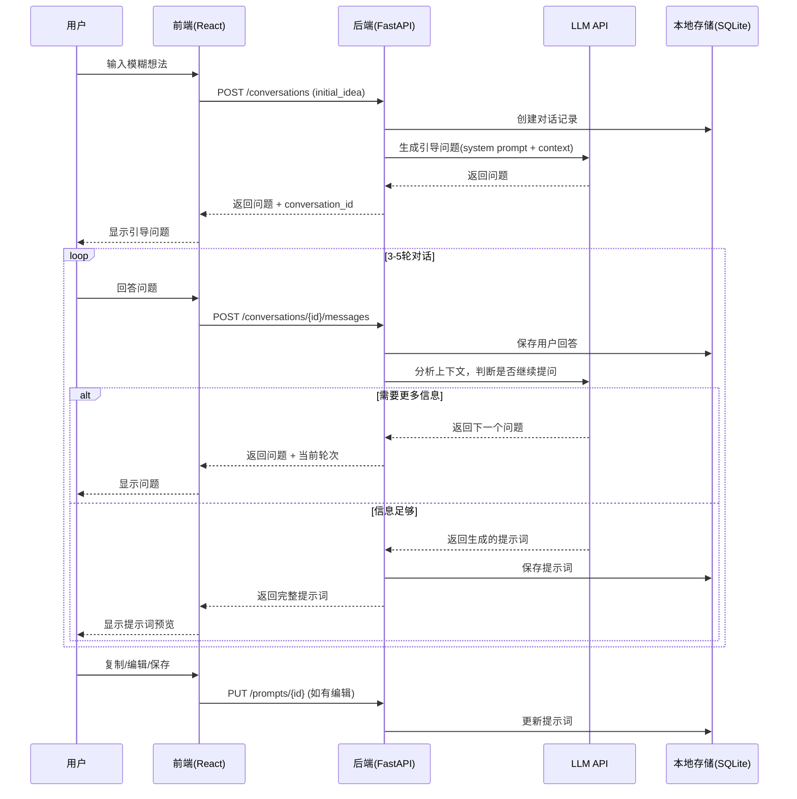
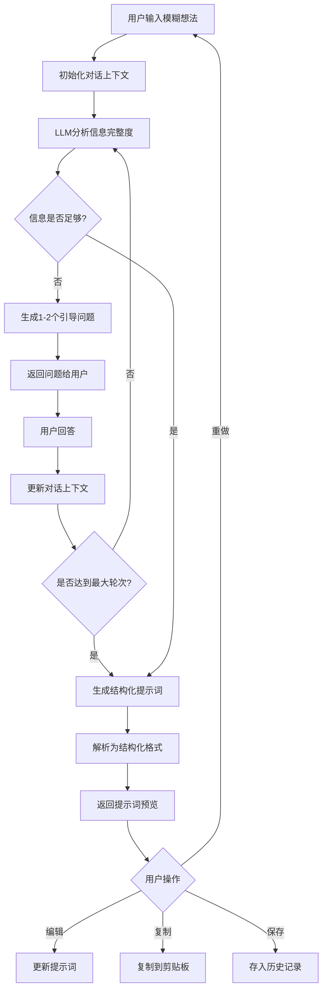

# PromptForge - 苏格拉底提示词工坊

> 产品需求文档 (PRD) v1.0
> 创建日期：2026-01-20

---

## 1. 产品概述

### 1.1 核心愿景
**通过苏格拉底式对话，将模糊想法逐步提炼为精准、高质量的AI提示词。**

### 1.2 用户画像

| 属性 | 描述 |
|------|------|
| **目标用户** | 个人使用 |
| **核心痛点** | 脑中有模糊想法，但难以直接表达为结构化、高效的提示词 |
| **使用场景** | 与ChatGPT/Claude等通用AI交流前，先用本工具"想清楚" |

### 1.3 差异化定位
市场上没有专注于"引导式提问→逐步细化"的工具，大多是直接优化或模板库。本产品采用**苏格拉底式产婆术交互**，通过3-5轮引导问题帮助用户发现并明确自己的真实需求。

---

## 2. 竞品分析

| 工具 | 核心特点 | 定价 | 差异化 |
|------|----------|------|--------|
| **PromptPerfect** | 自动优化提示词、支持文本+图像模型、反向提示词工程 | 免费10次/天，Pro $19.99/月 | 多模态、一键优化 |
| **FlowGPT** | 社区驱动的提示词库、用户贡献 | 免费 | 社区共享，质量参差 |
| **PromptBase** | 提示词交易市场 | $1.99-$9.99/条 | 付费购买高质量提示词 |
| **LangSmith** | 日志追踪、版本控制、实验管理 | 开发者向 | 面向工程团队 |
| **AIPRM** | 浏览器插件、SEO/营销专用 | 免费+付费 | 垂直领域 |

---

## 3. 功能规划

### 3.1 V1 MVP 核心功能

| 功能 | 描述 | 优先级 |
|------|------|--------|
| **苏格拉底对话引擎** | 用户输入模糊想法 → LLM提出引导性问题 → 3-5轮迭代细化 | P0 |
| **结构化提示词生成** | 对话结束后，自动生成结构化提示词（角色/任务/约束/输出格式） | P0 |
| **提示词预览与编辑** | 可视化展示生成的提示词，支持手动微调 | P0 |
| **一键复制** | 复制提示词到剪贴板 | P0 |
| **历史记录** | 保存对话历史和生成的提示词 | P1 |

### 3.2 V2+ 后续版本功能

| 版本 | 功能 |
|------|------|
| **V2** | 提示词模板库（预设场景模板）、提示词效果评估（A/B测试） |
| **V3** | 多语言支持、导出/分享功能（Markdown/JSON） |
| **V4** | 提示词版本对比、协作功能（如需扩展给团队） |

---

## 4. 业务逻辑

### 4.1 核心流程

```
用户输入模糊想法
       ↓
┌─────────────────────────────────┐
│   苏格拉底对话循环（3-5轮）      │
│   - LLM分析当前信息完整度        │
│   - 生成1-2个引导性问题          │
│   - 用户回答 → 更新上下文        │
│   - 判断是否足够生成提示词       │
└─────────────────────────────────┘
       ↓
生成结构化提示词
       ↓
用户预览/编辑/复制
       ↓
保存到历史记录
```

### 4.2 提问策略

| 轮次 | 聚焦点 |
|------|--------|
| 第1轮 | 理解核心任务（用户想让AI做什么？） |
| 第2轮 | 明确使用场景（谁会使用？在什么情况下？） |
| 第3轮 | 细化具体要求（有什么特殊要求或限制？） |
| 第4轮 | 确定输出格式（期望AI以什么形式回复？） |
| 第5轮 | 补充遗漏信息（还有什么需要AI注意的？） |

---

## 5. 数据契约

### 5.1 对话上下文 (ConversationContext)

```json
{
  "id": "uuid",
  "created_at": "ISO8601",
  "initial_idea": "用户的模糊想法",
  "turns": [
    {
      "role": "assistant",
      "content": "引导性问题",
      "timestamp": "ISO8601"
    },
    {
      "role": "user", 
      "content": "用户回答",
      "timestamp": "ISO8601"
    }
  ],
  "status": "in_progress | completed",
  "generated_prompt": null | PromptResult
}
```

### 5.2 生成的提示词 (PromptResult)

```json
{
  "id": "uuid",
  "conversation_id": "uuid",
  "created_at": "ISO8601",
  "prompt": {
    "role": "你是一个...",
    "task": "你的任务是...",
    "constraints": ["约束1", "约束2"],
    "output_format": "输出格式说明",
    "examples": []
  },
  "raw_text": "完整的提示词文本",
  "tags": ["标签1", "标签2"]
}
```

---

## 6. UI原型设计

### 6.1 方案A：经典对话式（Chat-Centric）

设计理念：**仿ChatGPT对话界面**，左侧历史列表，右侧对话主体，底部输入框。

```
┌─────────────────────────────────────────────────────────────────────────────┐
│  🧠 PromptForge - 苏格拉底提示词工坊                          [设置] [历史] │
├──────────────────┬──────────────────────────────────────────────────────────┤
│                  │                                                          │
│  📋 历史记录      │   ┌─────────────────────────────────────────────────┐   │
│  ───────────────  │   │ 🤖 助手                                         │   │
│                  │   │ 你想用AI完成什么任务？请简单描述你的想法。        │   │
│  ▸ 写一篇技术博客  │   └─────────────────────────────────────────────────┘   │
│  ▸ 代码审查助手   │                                                          │
│  ▸ 产品文案生成   │   ┌─────────────────────────────────────────────────┐   │
│                  │   │ 👤 你                                            │   │
│                  │   │ 我想让AI帮我写周报                                │   │
│                  │   └─────────────────────────────────────────────────┘   │
│                  │                                                          │
│                  │   ┌─────────────────────────────────────────────────┐   │
│                  │   │ 🤖 助手                              [2/5轮]    │   │
│                  │   │ 好的！为了生成更精准的提示词，请告诉我：         │   │
│                  │   │                                                  │   │
│                  │   │ 1. 你的周报主要汇报给谁？（直属领导/团队/跨部门）│   │
│                  │   │ 2. 周报需要包含哪些内容板块？                    │   │
│                  │   └─────────────────────────────────────────────────┘   │
│                  │                                                          │
│  ───────────────  │   ════════════════════════════════════════════════════  │
│  [+ 新对话]       │                                                          │
│                  │   ┌─────────────────────────────────────────────────┐   │
│                  │   │ 输入你的回答...                          [发送] │   │
│                  │   └─────────────────────────────────────────────────┘   │
│                  │                                                          │
│                  │   [跳过问题] [直接生成提示词]                            │
└──────────────────┴──────────────────────────────────────────────────────────┘
```

**优点**：用户熟悉的对话模式，学习成本低  
**缺点**：生成的提示词展示空间有限

---

### 6.2 方案B：双栏并行式（Split View）⭐ 推荐

设计理念：**左侧对话引导，右侧实时预览提示词**，边聊边看结果。

```
┌─────────────────────────────────────────────────────────────────────────────┐
│  🧠 PromptForge                                    [历史] [模板] [设置] [?] │
├─────────────────────────────────────┬───────────────────────────────────────┤
│                                     │                                       │
│  💬 对话引导区                       │  📝 提示词预览区                       │
│  ─────────────────────────────────  │  ─────────────────────────────────    │
│                                     │                                       │
│  ┌───────────────────────────────┐  │  ┌─────────────────────────────────┐  │
│  │ 🤖 你的周报读者是谁？          │  │  │ ## 角色定义                     │  │
│  └───────────────────────────────┘  │  │ 你是一位专业的周报撰写助手...   │  │
│                                     │  │                                 │  │
│  ┌───────────────────────────────┐  │  │ ## 任务描述                     │  │
│  │ 👤 直属领导和项目经理          │  │  │ 帮助用户撰写面向领导的周报...   │  │
│  └───────────────────────────────┘  │  │                                 │  │
│                                     │  │ ## 约束条件                     │  │
│  ┌───────────────────────────────┐  │  │ - 语言简洁专业                  │  │
│  │ 🤖 周报需要突出哪些重点？      │  │  │ - 突出成果和数据                │  │
│  │    □ 本周成果  □ 遇到的问题   │  │  │                                 │  │
│  │    □ 下周计划  □ 需要的支持   │  │  │ ## 输出格式                     │  │
│  └───────────────────────────────┘  │  │ 使用Markdown格式...             │  │
│                                     │  └─────────────────────────────────┘  │
│  ┌───────────────────────────────┐  │                                       │
│  │ 输入回答...            [发送] │  │  ┌─────────────────────────────────┐  │
│  └───────────────────────────────┘  │  │ [复制] [编辑] [导出] [测试效果] │  │
│                                     │  └─────────────────────────────────┘  │
│  进度: ████████░░ 4/5轮             │                                       │
│  [跳过] [重新开始]                  │                                       │
└─────────────────────────────────────┴───────────────────────────────────────┘
```

**优点**：实时看到提示词演进过程，所见即所得  
**缺点**：需要更大屏幕空间

---

### 6.3 方案C：向导步骤式（Wizard Flow）

设计理念：**分步骤卡片式引导**，每一步聚焦一个问题，最后汇总生成。

```
┌─────────────────────────────────────────────────────────────────────────────┐
│  🧠 PromptForge                                              [历史] [设置] │
├─────────────────────────────────────────────────────────────────────────────┤
│                                                                             │
│                    ① ──── ② ──── ③ ──── ④ ──── ⑤                          │
│                    ●      ●      ○      ○      ○                           │
│                  想法    场景   细节    约束   生成                         │
│                                                                             │
├─────────────────────────────────────────────────────────────────────────────┤
│                                                                             │
│   ┌───────────────────────────────────────────────────────────────────┐    │
│   │                                                                   │    │
│   │                     📍 第2步：使用场景                            │    │
│   │                                                                   │    │
│   │   你的周报主要给谁看？                                            │    │
│   │                                                                   │    │
│   │   ┌─────────────┐  ┌─────────────┐  ┌─────────────┐              │    │
│   │   │  👔 领导    │  │  👥 团队    │  │  🏢 跨部门   │              │    │
│   │   │  (已选中)   │  │             │  │             │              │    │
│   │   └─────────────┘  └─────────────┘  └─────────────┘              │    │
│   │                                                                   │    │
│   │   或者自定义描述:                                                 │    │
│   │   ┌─────────────────────────────────────────────────────────┐    │    │
│   │   │ 直属领导和项目经理，他们关注项目进度和风险...            │    │    │
│   │   └─────────────────────────────────────────────────────────┘    │    │
│   │                                                                   │    │
│   │                    [← 上一步]        [下一步 →]                   │    │
│   │                                                                   │    │
│   └───────────────────────────────────────────────────────────────────┘    │
│                                                                             │
│   💡 提示：明确读者有助于调整周报的语气和重点                              │
│                                                                             │
└─────────────────────────────────────────────────────────────────────────────┘
```

**优点**：结构清晰，每步聚焦，适合新手  
**缺点**：灵活性较低，对话感弱

---

### 6.4 方案对比

| 维度 | 方案A 对话式 | 方案B 双栏式 | 方案C 向导式 |
|------|-------------|-------------|-------------|
| **学习成本** | ⭐⭐⭐⭐⭐ 最低 | ⭐⭐⭐⭐ 低 | ⭐⭐⭐ 中等 |
| **灵活性** | ⭐⭐⭐⭐⭐ 高 | ⭐⭐⭐⭐ 高 | ⭐⭐⭐ 中等 |
| **实时反馈** | ⭐⭐⭐ 一般 | ⭐⭐⭐⭐⭐ 最佳 | ⭐⭐ 较弱 |
| **开发复杂度** | ⭐⭐⭐ 中等 | ⭐⭐⭐⭐ 较高 | ⭐⭐ 较低 |
| **苏格拉底体验** | ⭐⭐⭐⭐ 好 | ⭐⭐⭐⭐⭐ 最佳 | ⭐⭐⭐ 一般 |

---

## 7. 架构设计

### 7.1 技术栈

| 层级 | 技术选择 | 理由 |
|------|----------|------|
| **前端框架** | React + TypeScript | 生态成熟，组件化开发 |
| **UI组件库** | Tailwind CSS + shadcn/ui | 现代美观，快速开发 |
| **构建工具** | Vite | 快速热更新 |
| **后端框架** | FastAPI (Python) | 异步支持好，自动生成API文档 |
| **数据库** | SQLite | 本地运行，零配置 |
| **LLM API** | OpenAI / 国内兼容API (DeepSeek/Qwen) | 支持配置切换 |

### 7.2 项目目录结构

```
prompt-forge/
├── frontend/                    # 前端应用
│   ├── src/
│   │   ├── components/
│   │   │   ├── ChatPanel.tsx        # 对话面板组件
│   │   │   ├── PromptPreview.tsx    # 提示词预览组件
│   │   │   ├── HistoryList.tsx      # 历史记录列表
│   │   │   ├── ProgressBar.tsx      # 对话进度条
│   │   │   └── PromptEditor.tsx     # 提示词编辑器
│   │   ├── pages/
│   │   │   ├── Home.tsx             # 主页(方案选择)
│   │   │   ├── ChatView.tsx         # 方案A: 对话式
│   │   │   ├── SplitView.tsx        # 方案B: 双栏式
│   │   │   └── WizardView.tsx       # 方案C: 向导式
│   │   ├── hooks/
│   │   │   ├── useConversation.ts   # 对话状态管理
│   │   │   └── usePromptHistory.ts  # 历史记录管理
│   │   ├── services/
│   │   │   └── api.ts               # API调用封装
│   │   ├── types/
│   │   │   └── index.ts             # TypeScript类型定义
│   │   ├── App.tsx
│   │   └── main.tsx
│   ├── package.json
│   └── vite.config.ts
│
├── backend/                     # 后端应用
│   ├── app/
│   │   ├── main.py                  # FastAPI入口
│   │   ├── config.py                # 配置管理(API Key等)
│   │   ├── models/
│   │   │   ├── conversation.py      # 对话模型
│   │   │   └── prompt.py            # 提示词模型
│   │   ├── routers/
│   │   │   ├── conversations.py     # 对话相关API
│   │   │   └── prompts.py           # 提示词相关API
│   │   ├── services/
│   │   │   ├── llm_service.py       # LLM调用封装
│   │   │   ├── socratic_engine.py   # 苏格拉底对话引擎
│   │   │   └── prompt_generator.py  # 提示词生成器
│   │   ├── prompts/
│   │   │   ├── system_prompts.py    # 系统提示词模板
│   │   │   └── output_formats.py    # 输出格式定义
│   │   └── database/
│   │       ├── db.py                # 数据库连接
│   │       └── crud.py              # CRUD操作
│   ├── requirements.txt
│   └── .env.example
│
├── data/                        # 本地数据存储
│   └── prompt_forge.db              # SQLite数据库
│
├── README.md
└── docker-compose.yml           # (可选)容器化部署
```

### 7.3 核心流程图



### 7.4 苏格拉底对话引擎流程图



### 7.5 API 设计

| 方法 | 端点 | 描述 |
|------|------|------|
| `POST` | `/api/conversations` | 创建新对话，传入初始想法 |
| `GET` | `/api/conversations` | 获取历史对话列表 |
| `GET` | `/api/conversations/{id}` | 获取单个对话详情 |
| `POST` | `/api/conversations/{id}/messages` | 发送用户回答，获取下一个问题或提示词 |
| `DELETE` | `/api/conversations/{id}` | 删除对话 |
| `GET` | `/api/prompts` | 获取已保存的提示词列表 |
| `GET` | `/api/prompts/{id}` | 获取单个提示词 |
| `PUT` | `/api/prompts/{id}` | 更新提示词 |
| `DELETE` | `/api/prompts/{id}` | 删除提示词 |

### 7.6 关键请求/响应示例

**创建对话**
```json
// POST /api/conversations
// Request
{
  "initial_idea": "我想让AI帮我写周报"
}

// Response
{
  "id": "conv_abc123",
  "status": "in_progress",
  "current_turn": 1,
  "max_turns": 5,
  "question": "好的！为了生成更精准的提示词，请告诉我：你的周报主要汇报给谁？"
}
```

**发送回答**
```json
// POST /api/conversations/conv_abc123/messages
// Request
{
  "content": "直属领导和项目经理"
}

// Response (继续提问)
{
  "status": "in_progress",
  "current_turn": 2,
  "question": "周报需要包含哪些内容板块？（如：本周成果、遇到问题、下周计划）"
}

// Response (生成提示词)
{
  "status": "completed",
  "prompt": {
    "id": "prompt_xyz789",
    "role": "你是一位专业的周报撰写助手...",
    "task": "根据用户提供的工作内容，生成简洁高效的周报...",
    "constraints": ["语言简洁专业", "突出成果和数据"],
    "output_format": "使用Markdown格式，包含标题和分点",
    "raw_text": "完整的提示词文本..."
  }
}
```

### 7.7 LLM API 兼容层设计

```python
# backend/app/services/llm_service.py

from abc import ABC, abstractmethod

class LLMProvider(ABC):
    @abstractmethod
    async def chat(self, messages: list, **kwargs) -> str:
        pass

class OpenAIProvider(LLMProvider):
    # OpenAI API 实现
    pass

class DeepSeekProvider(LLMProvider):
    # DeepSeek API 实现（国内）
    pass

class QwenProvider(LLMProvider):
    # 通义千问 API 实现（国内）
    pass

# 工厂函数，根据配置选择Provider
def get_llm_provider(provider_name: str) -> LLMProvider:
    providers = {
        "openai": OpenAIProvider,
        "deepseek": DeepSeekProvider,
        "qwen": QwenProvider,
    }
    return providers[provider_name]()
```

### 7.8 苏格拉底引擎核心Prompt

```python
SOCRATIC_SYSTEM_PROMPT = """
你是一位苏格拉底式的提示词引导专家。你的任务是通过提问帮助用户将模糊的想法转化为精准的AI提示词。

## 工作原则
1. **产婆术**：不直接给答案，而是通过提问引导用户自己发现需求
2. **渐进式**：每次只问1-2个问题，避免信息过载
3. **聚焦关键**：优先询问：目标用户、具体任务、约束条件、期望输出格式

## 提问策略
- 第1轮：理解核心任务（用户想让AI做什么？）
- 第2轮：明确使用场景（谁会使用？在什么情况下？）
- 第3轮：细化具体要求（有什么特殊要求或限制？）
- 第4轮：确定输出格式（期望AI以什么形式回复？）
- 第5轮：补充遗漏信息（还有什么需要AI注意的？）

## 输出格式
当信息足够时，生成结构化提示词，包含：
- 角色定义
- 任务描述
- 约束条件
- 输出格式
- 示例（如适用）

当前对话上下文：
{context}

请根据上下文，决定是继续提问还是生成最终提示词。
"""
```

---

## 8. 风险与缓解

| 风险 | 影响 | 缓解措施 |
|------|------|----------|
| **LLM响应不稳定** | 生成的问题质量参差 | 设计fallback问题库；添加重试机制 |
| **API调用成本** | 频繁调用产生费用 | 本地缓存；限制每日调用次数 |
| **提示词质量** | 生成的提示词不够精准 | 迭代优化system prompt；用户可手动编辑 |
| **国内API兼容性** | 不同API响应格式差异 | 抽象Provider层，统一接口 |

---

## 9. 下一步行动

- [ ] 确定首选UI方案（推荐方案B双栏式）
- [ ] 配置LLM API（OpenAI或国内API）
- [ ] 搭建前后端项目骨架
- [ ] 实现苏格拉底对话引擎核心逻辑
- [ ] 完成MVP功能开发与测试

---

## 10. 更新日志

### v1.1 - 2026-01-27

#### 已完成功能

| 需求编号 | 功能描述 | 状态 |
|----------|----------|------|
| **P0-1** | 已保存提示词可交互（点击打开预览/复制/删除） | ✅ 已完成 |
| **P0-2** | 输入框支持换行（Shift+Enter 换行，Enter 发送） | ✅ 已完成 |
| **P0-3** | 输出区编辑/复制按钮置顶悬浮 + 黑框右上角复制按钮 | ✅ 已完成 |
| **P0-4** | 设置页适配代理厂商（baseURL + apiKey + model 组合配置） | ✅ 已完成 |
| **P1-1** | 引导对话增加【换个思路】按钮 | ✅ 已完成 |
| **P1-2** | 生成完整 Prompt 后支持进一步细化流程（v1→v2 迭代） | ✅ 已完成 |
| **P1-3** | 自定义需求未提交时禁用生成按钮 + 输入框长度自适配 | ✅ 已完成 |

#### 详细变更

**P0-1: 已保存提示词可交互**
- 修改文件：`HistoryList.tsx`, `SplitView.tsx`, `useConversation.ts`
- 点击历史提示词可在预览区显示
- 添加复制按钮，支持一键复制提示词内容
- 添加删除按钮

**P0-2: 输入框支持换行**
- 修改文件：`ChatPanel.tsx`
- 将 `<input>` 改为 `<textarea>`
- Enter 发送消息，Shift+Enter 换行
- 输入框高度自适应内容

**P0-3: 工具栏置顶悬浮**
- 修改文件：`PromptPreview.tsx`
- 编辑/复制按钮使用 `sticky top-0` 定位，滚动时保持可见
- 黑色代码框右上角添加独立复制按钮

**P0-4: 设置页适配代理厂商**
- 修改文件：`SplitView.tsx`, `api.ts`, `conversation.py`(schema), `llm_service.py`, `conversations.py`(router), `crud.py`, `conversation.py`(model)
- 新增 Base URL 配置项，支持自定义 API 代理地址
- 新增 `custom` 提供商类型，使用 OpenAI 兼容接口
- 新增 `openai` 提供商支持
- `base_url` 存储到数据库，后续消息自动使用

**P1-1: 换个思路按钮**
- 修改文件：`ChatPanel.tsx`, `useConversation.ts`, `api.ts`, `conversations.py`
- 在对话过程中可点击"换个思路"按钮
- 后端新增 `/api/conversations/{id}/rethink` 端点
- LLM 从不同角度重新生成引导问题

**P1-2: 细化流程**
- 修改文件：`ChatPanel.tsx`
- 生成提示词后显示细化维度快捷按钮：
  - 🎯 目标更明确
  - 📥 输入更完整
  - 📤 输出更可控
  - ⚠️ 约束更严格
  - 💡 添加示例

**P1-3: 自定义条目状态管理**
- 修改文件：`ChatPanel.tsx`
- 自定义输入框改为 `<textarea>`，支持多行输入
- 输入框高度自适应（最大 96px）
- 有未添加的自定义条目时，显示警告提示并禁用确认按钮

#### 新增 API 端点

| 方法 | 端点 | 描述 |
|------|------|------|
| `POST` | `/api/conversations/{id}/rethink` | 换个思路，重新生成当前问题 |

#### 数据库变更

- `conversations` 表新增 `base_url` 字段（Text, nullable）

---

### v1.2 - 2026-01-27

#### 已完成功能

| 需求编号 | 功能描述 | 状态 |
|----------|----------|------|
| **品牌升级** | 产品名改为 PromptGo/普提狗，融入苏格拉底品牌文案 | ✅ 已完成 |
| **UI重设计** | 参考苹果官网风格，重新设计网页端界面 | ✅ 已完成 |
| **元提示词升级** | 基于 PromptSpec/产婆术/指令层级安全框架 | ✅ 已完成 |
| **框架选择器** | 提示词框架选择器移至对话上端（卡片式展示） | ✅ 已完成 |
| **RAG文件上传** | 文件上传 + 多模态解析 + 专业知识学习 | ✅ 已完成 |
| **输入法兼容** | 修复输入法回车键被误识别为发送命令 | ✅ 已完成 |

#### 详细变更

**品牌升级: PromptGo 普提狗**
- 修改文件：`SplitView.tsx`, `ChatPanel.tsx`, `PromptPreview.tsx`, `HistoryList.tsx`, `main.py`
- 产品名从 PromptForge 改为 PromptGo（中文名：普提狗）
- 融入苏格拉底哲学品牌文案："AI 时代的精神助产术"
- 普提狗吉祥物组件 🐕
- 品牌 Slogan：未经审视的 Prompt 是不值得发送的

**UI重设计: 苹果风格**
- 修改文件：`index.css`, `SplitView.tsx`, `ChatPanel.tsx`, `PromptPreview.tsx`, `HistoryList.tsx`
- 苹果官网风格设计系统：
  - 品牌色系：主色 `#0071e3`，强调色 `#bf5af2`，成功色 `#30d158`
  - 圆角卡片、玻璃态效果、渐变色
  - SF Pro 字体风格
  - 平滑过渡动画

**元提示词升级: v2.0**
- 修改文件：`socratic_engine.py`
- 基于 promptingguide.ai 和 RAG 语料库框架
- 新增 PromptSpec 字段定义（goal/audience/persona/constraints/tools/quality_bar）
- 指令层级安全：SYSTEM > DEVELOPER > USER > 历史 > 检索
- 产婆式澄清原则：≤5问、按影响排序、选项优先
- 框架模板升级：所有框架添加 must_not 禁止事项和质量标准
- 新增文档：`docs/prompt-writing-corpus.md`（RAG 语料库索引）

**框架选择器: 卡片式展示**
- 修改文件：`ChatPanel.tsx`, `SplitView.tsx`
- 4 个框架卡片：Standard / LangGPT / CO-STAR / XML
- 选中状态带渐变色和勾选标记
- 点击即时切换，自动保存到 localStorage
- 从设置弹窗移至对话上端，更易触达

**RAG文件上传: 多模态解析**
- 新增文件：`document_parser.py`, `documents.py`
- 修改文件：`main.py`, `SplitView.tsx`, `ChatPanel.tsx`
- 支持格式：PDF、Word、图片（PNG/JPG）、TXT/MD
- 图片 OCR：调用千问 Qwen-VL 多模态模型
- PDF 解析：PyMuPDF 文本提取 + 扫描件 OCR
- Word 解析：python-docx 提取文本和表格
- 解析内容自动注入对话上下文，增强提示词生成

**输入法兼容修复**
- 修改文件：`ChatPanel.tsx`
- 检测 `isComposing` 状态，输入法组合中不处理回车
- 兼容中文、日文等需要组合输入的语言

#### 新增 API 端点

| 方法 | 端点 | 描述 |
|------|------|------|
| `POST` | `/api/documents/parse` | 解析上传的文档（支持 PDF/Word/图片/TXT） |

#### 新增依赖

| 包名 | 用途 |
|------|------|
| `python-multipart` | FastAPI 文件上传支持 |
| `pymupdf` | PDF 文档解析 |
| `python-docx` | Word 文档解析 |

#### 新增文件

| 文件路径 | 描述 |
|----------|------|
| `backend/app/services/document_parser.py` | 文档解析服务（多格式支持） |
| `backend/app/routers/documents.py` | 文档解析 API 路由 |
| `docs/prompt-writing-corpus.md` | RAG 语料库索引文档 |

---

*文档版本：v1.2 | 最后更新：2026-01-27*
